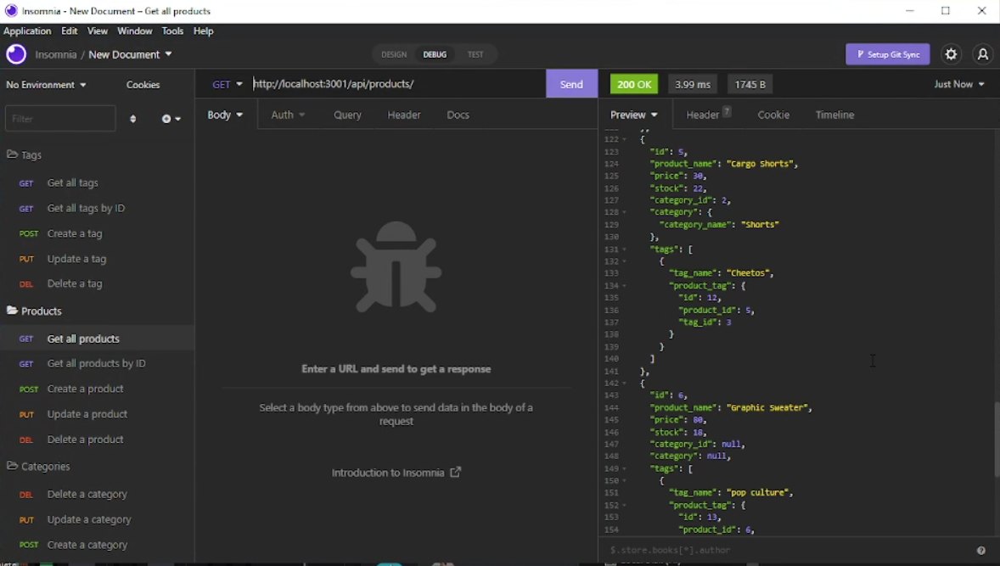

# Nice-E-Commerce-Back-End

  

  ## Description

  This is an E-Commerce Backend using mySQL and Express! Allows for grabbing and creating data within the generated database.

  ## Table Of Contents

  - [Screenshots](#screenshots)
  - [Installation](#installation)
  - [Usage](#usage)
  - [License](#license)
  - [Guidelines](#guidelines)
  - [Questions](#questions)
  - [Tests](#tests)
  - [Video](#video)

  ## Screenshots

  ## Installation

1) Type in npm i to install packages
2) Type in npm i sequelize, npm i dotenv, and npm i express to continue installing packages
3) Create a .env file with the parameters shown in the walkthrough video with your mySQL details
4) Type in "mysql -u root -p" and enter your SQL password
5) Type "quit" to exit mySQL
6) Type in npm run seed
7) Type in npm start
8) You are now free to use Insomnia to access the database

  ## Usage

  Use Insomnia to get, post, put, and delete information within the database
  
## License
    This work is licensed under Creative Commons Attribution 3.0 Unported License.
    https://creativecommons.org/terms#8

  ## Guidelines

  You are open to do with this code as you wish

  ## Questions

  This repo was created by https://github.com/BenBasic
  To contact me, please send an email to Benjamin@TreneonGames.com

  ## Video
https://youtu.be/pB0ZVnoMJNw